# AWS Lambda TypeScript Template

[](https://github.com/your-org/lambda-typescript-template/actions)
[](https://github.com/your-org/lambda-typescript-template)
[](https://www.typescriptlang.org/)
[](https://aws.amazon.com/lambda/)
[](https://www.terraform.io/)
[](LICENSE)

A production-ready AWS Lambda template using **TypeScript**, **AWS Powertools**, and **Terraform** for infrastructure as code. Features serverless CRUD APIs with DynamoDB, EventBridge integration, comprehensive testing, and CI/CD pipelines.

## 🏗️ Architecture



```mermaid
graph TB
    subgraph "Client"
        C[Web/Mobile App]
    end

    subgraph "API Layer"
        AG[API Gateway v2<br/>HTTP API]
    end

    subgraph "Compute Layer"
        LH[Health Check<br/>Lambda Function]
        LU[Users API<br/>Lambda Function]
    end

    subgraph "Data Layer"
        DU[(Users Table<br/>DynamoDB)]
    end

    subgraph "Monitoring & Security"
        CW[CloudWatch<br/>Logs & Metrics]
        XR[X-Ray<br/>Tracing]
        IAM[IAM Roles<br/>& Policies]
    end

    C --> AG
    AG --> LH
    AG --> LU
    LU --> DU

    LH --> CW
    LU --> CW
    LH --> XR
    LU --> XR

    LU -.-> IAM
    DU -.-> IAM

    style AG fill:#ff9900
    style LH fill:#ff9900
    style LU fill:#ff9900
    style DU fill:#232f3e
    style CW fill:#232f3e
    style XR fill:#232f3e
```

## ✨ Features

- **🎯 TypeScript**: Full type safety with strict TypeScript configuration
- **⚡ AWS Powertools**: Structured logging, metrics, tracing, and parameters
- **🏗️ Infrastructure as Code**: Complete Terraform configuration
- **🔄 Event-Driven**: EventBridge integration for decoupled architecture
- **💾 Data Persistence**: DynamoDB with GSI for efficient querying
- **🧪 Comprehensive Testing**: Unit and integration tests with Jest
- **🔍 Observability**: CloudWatch logs, metrics, and X-Ray tracing
- **🚀 CI/CD Ready**: GitHub Actions for automated testing and deployment
- **📋 API Documentation**: OpenAPI 3.0 specification included
- **🔒 Security**: IAM least privilege, encryption at rest and in transit

## 🚀 Quick Start

### Prerequisites

- **Node.js** 18+ and npm
- **AWS CLI** configured with appropriate permissions
- **Terraform** 1.0+
- **Docker** (for local testing)

### Installation

1. **Clone the template**
   ```bash
   git clone https://github.com/your-org/lambda-typescript-template.git
   cd lambda-typescript-template
   ```

2. **Install dependencies**
   ```bash
   npm install
   ```

3. **Build the project**
   ```bash
   npm run build
   ```

4. **Run tests**
   ```bash
   npm test
   ```

### Deployment

1. **Initialize Terraform**
   ```bash
   cd terraform
   terraform init
   ```

2. **Plan deployment**
   ```bash
   terraform plan -var="environment=dev"
   ```

3. **Deploy infrastructure**
   ```bash
   terraform apply -var="environment=dev"
   ```

4. **Get API endpoint**
   ```bash
   terraform output api_gateway_url
   ```

## 📁 Project Structure

```
├── src/
│   ├── hello/                    # Health check Lambda function
│   │   ├── index.ts              # Function handler
│   │   └── __tests__/            # Function tests
│   ├── users/                    # Users CRUD API
│   │   ├── index.ts              # Function handler
│   │   ├── types.ts              # TypeScript types
│   │   └── __tests__/            # Function tests
│   ├── posts/                    # Posts CRUD API
│   │   ├── index.ts              # Function handler
│   │   ├── types.ts              # TypeScript types
│   │   └── __tests__/            # Function tests
│   └── event-processor/          # EventBridge event processor
│       ├── index.ts              # Function handler
│       └── __tests__/            # Function tests
├── terraform/                    # Infrastructure as Code
│   ├── serverless.tf             # Main infrastructure
│   ├── variables.tf              # Input variables
│   └── outputs.tf                # Output values
├── scripts/                      # Build and utility scripts
│   ├── build.js                  # Function packaging script
│   └── install-deps.js           # Dependency installer
├── .github/workflows/            # CI/CD pipelines
│   ├── ci.yml                    # Main CI pipeline
│   └── build.yml                 # Build pipeline
├── openapi.yaml                  # API documentation
├── package.json                  # Project configuration
├── tsconfig.json                 # TypeScript configuration
├── jest.config.js                # Jest test configuration
└── README.md                     # This file
```

## 🔧 Development

### Local Development

1. **Start development mode**
   ```bash
   npm run dev
   ```

2. **Run tests in watch mode**
   ```bash
   npm run test:watch
   ```

3. **Type checking**
   ```bash
   npm run compile
   ```

### Testing

```bash
# Run all tests
npm test

# Run unit tests only
npm run test:unit

# Run integration tests only
npm run test:integration

# Generate coverage report
npm run test:coverage
```

### Code Quality

```bash
# Lint code
npm run lint

# Auto-fix linting issues
npm run lint:fix

# Security audit
npm run security:check
```

### Adding New Functions

1. Create a new directory under `src/` (e.g., `src/orders/`)
2. Add your TypeScript handler and types
3. Add comprehensive tests
4. Update `terraform/serverless.tf` to include the new function
5. The build process will automatically detect and package the function

## 🌐 API Endpoints

After deployment, your API will be available at the endpoint shown by `terraform output api_gateway_url`.

### Health Check
```http
GET /health
```

**Response:**
```json
{
  "status": "healthy",
  "timestamp": "2023-01-01T00:00:00.000Z",
  "version": "1.0.0"
}
```

### Users API

#### Create User
```http
POST /users
Content-Type: application/json

{
  "name": "John Doe",
  "email": "john@example.com"
}
```

#### Get User
```http
GET /users/{id}
```

#### Update User
```http
PUT /users/{id}
Content-Type: application/json

{
  "name": "Jane Doe",
  "email": "jane@example.com"
}
```

#### Delete User
```http
DELETE /users/{id}
```

#### List Users
```http
GET /users?limit=10&cursor=eyJpZCI6IjEyMyJ9
```

### Posts API

#### Create Post
```http
POST /posts
Content-Type: application/json

{
  "title": "My Post",
  "content": "Post content here",
  "userId": "user-123"
}
```

#### Get Post
```http
GET /posts/{id}
```

#### List Posts by User
```http
GET /posts?userId=user-123&limit=10
```

## ⚙️ Configuration

### Environment Variables

| Variable | Description | Default | Required |
|----------|-------------|---------|----------|
| `LOG_LEVEL` | Logging level (DEBUG, INFO, WARN, ERROR) | INFO | No |
| `POWERTOOLS_SERVICE_NAME` | Service name for observability | lambda-typescript-template | No |
| `POWERTOOLS_METRICS_NAMESPACE` | CloudWatch metrics namespace | LambdaTemplate | No |
| `USERS_TABLE_NAME` | DynamoDB users table name | Set by Terraform | Yes |
| `POSTS_TABLE_NAME` | DynamoDB posts table name | Set by Terraform | Yes |
| `EVENT_BUS_NAME` | EventBridge custom bus name | Set by Terraform | Yes |

### Terraform Variables

| Variable | Description | Default | Required |
|----------|-------------|---------|----------|
| `aws_region` | AWS region for deployment | us-east-1 | No |
| `environment` | Environment name (dev, staging, prod) | dev | No |
| `namespace` | Resource naming prefix | "" | No |
| `function_name` | Base name for Lambda functions | lambda-typescript-template | No |

## 🔍 Monitoring & Observability

### CloudWatch Dashboards

The template includes CloudWatch dashboards for:
- Lambda function metrics (duration, errors, throttles)
- API Gateway metrics (requests, latency, errors)
- DynamoDB metrics (consumed capacity, throttles)

### X-Ray Tracing

All Lambda functions are configured with X-Ray tracing enabled:
```typescript
import { Tracer } from '@aws-lambda-powertools/tracer';

const tracer = new Tracer({ serviceName: 'lambda-typescript-template' });
```

### Structured Logging

Uses AWS Powertools Logger for consistent, structured logging:
```typescript
import { Logger } from '@aws-lambda-powertools/logger';

const logger = new Logger({ serviceName: 'lambda-typescript-template' });
logger.info('Processing request', { userId: 'user-123' });
```

### Custom Metrics

Track business metrics with AWS Powertools Metrics:
```typescript
import { Metrics } from '@aws-lambda-powertools/metrics';

const metrics = new Metrics({ namespace: 'LambdaTemplate' });
metrics.addMetric('UserCreated', 'Count', 1);
```

## 🚀 CI/CD Pipeline

### GitHub Actions Workflows

1. **CI Pipeline** (`.github/workflows/ci.yml`)
   - TypeScript compilation
   - ESLint code quality checks
   - Jest unit and integration tests
   - Security vulnerability scanning
   - Code coverage reporting

2. **Build Pipeline** (`.github/workflows/build.yml`)
   - Function packaging
   - Terraform validation
   - Artifact uploading

### Deployment Strategies

- **Development**: Automatic deployment on push to `develop` branch
- **Staging**: Automatic deployment on push to `main` branch
- **Production**: Manual approval required for deployment

## 🔒 Security

### IAM Permissions

Each Lambda function follows the principle of least privilege:
- Users function: DynamoDB read/write on users table, EventBridge put events
- Posts function: DynamoDB read/write on posts table, EventBridge put events
- Event processor: SQS send message permissions

### Data Protection

- **Encryption at Rest**: DynamoDB tables encrypted with AWS managed keys
- **Encryption in Transit**: All API communication over HTTPS
- **Input Validation**: Request validation using TypeScript types and runtime checks

### Security Scanning

- **npm audit**: Dependency vulnerability scanning
- **OWASP**: Security policy compliance
- **CodeQL**: Static analysis for security vulnerabilities

## 💰 Cost Optimization

- **On-Demand Billing**: DynamoDB pay-per-request pricing
- **ARM64 Architecture**: Graviton2 processors for better price-performance
- **Log Retention**: CloudWatch logs automatically expire after 14 days
- **HTTP API**: Lower cost than REST API for simple use cases

## 🤝 Contributing

1. Fork the repository
2. Create a feature branch (`git checkout -b feature/amazing-feature`)
3. Make your changes following the code style
4. Add tests for new functionality
5. Commit your changes (`git commit -m 'Add amazing feature'`)
6. Push to the branch (`git push origin feature/amazing-feature`)
7. Open a Pull Request

### Code Style

- Use TypeScript strict mode
- Follow ESLint configuration
- Write comprehensive tests (aim for 100% coverage)
- Use AWS Powertools for observability
- Follow functional programming principles

## 📄 License

This project is licensed under the MIT License - see the [LICENSE](LICENSE) file for details.

## 🙏 Acknowledgments

- [AWS Lambda Powertools TypeScript](https://docs.powertools.aws.dev/lambda/typescript/)
- [AWS CDK Construct Library](https://constructs.dev/)
- [Terraform AWS Provider](https://registry.terraform.io/providers/hashicorp/aws/)
- [Jest Testing Framework](https://jestjs.io/)

## 📚 Additional Resources

- [AWS Lambda Developer Guide](https://docs.aws.amazon.com/lambda/latest/dg/)
- [AWS Well-Architected Framework](https://aws.amazon.com/architecture/well-architected/)
- [Serverless Application Lens](https://docs.aws.amazon.com/wellarchitected/latest/serverless-applications-lens/)
- [TypeScript Handbook](https://www.typescriptlang.org/docs/)

---

**Built with ❤️ for serverless applications**